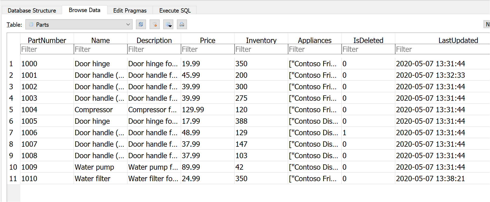

# Microsoft Graph search connector sample

[](https://github.com/microsoftgraph/msgraph-search-connector-sample/actions/workflows/dotnet.yml) 

This .NET sample application demonstrates how to build a custom [Microsoft Graph connector](https://learn.microsoft.com/graph/connecting-external-content-connectors-overview) using Microsoft Graph APIs to index items from a sample appliance parts inventory, and have that data appear in [Microsoft Search](https://learn.microsoft.com/microsoftsearch/) results.

## Prerequisites

- [.NET 8.x](https://dotnet.microsoft.com/download)
- [Entity Framework Core Tools](https://learn.microsoft.com/ef/core/miscellaneous/cli/dotnet) (`dotnet tool install --global dotnet-ef`)
- Some way to update a SQLite database. For example, the [DB Browser for SQLite](https://sqlitebrowser.org/).

## Register an app in Azure portal

In this step you will register an application that supports app-only authentication using [client credentials flow](/azure/active-directory/develop/v2-oauth2-client-creds-grant-flow).

1. Open a browser and navigate to the [Azure Active Directory admin center](https://aad.portal.azure.com) and login using a Global administrator account.

1. Select **Azure Active Directory** in the left-hand navigation, then select **App registrations** under **Manage**.

1. Select **New registration**. Enter a name for your application, for example, `Parts Inventory Connector`.

1. Set **Supported account types** to **Accounts in this organizational directory only**.

1. Leave **Redirect URI** empty.

1. Select **Register**. On the application's **Overview** page, copy the value of the **Application (client) ID** and **Directory (tenant) ID** and save them, you will need these values in the next step.

1. Select **API permissions** under **Manage**.

1. Remove the default **User.Read** permission under **Configured permissions** by selecting the ellipses (**...**) in its row and selecting **Remove permission**.

1. Select **Add a permission**, then **Microsoft Graph**.

1. Select **Application permissions**.

1. Select **ExternalConnection.ReadWrite.OwnedBy** and **ExternalItem.ReadWrite.OwnedBy**, then select **Add permissions**.

1. Select **Grant admin consent for...**, then select **Yes** to provide admin consent for the selected permission.

1. Select **Certificates and secrets** under **Manage**, then select **New client secret**.

1. Enter a description, choose a duration, and select **Add**.

1. Copy the secret from the **Value** column, you will need it in the next steps.

    > **IMPORTANT**
    > This client secret is never shown again, so make sure you copy it now.

## Configure the app

1. Open your command line interface (CLI) in the directory where **PartsInventoryConnector.csproj** is located.
1. Run the following command to initialize [user secrets](https://learn.microsoft.com/aspnet/core/security/app-secrets) for the project.

    ```dotnetcli
    dotnet user-secrets init
    ```

1. Run the following commands to store your app ID, app secret, and tenant ID in the user secret store.

    ```dotnetcli
    dotnet user-secrets set settings:clientId <client-id>
    dotnet user-secrets set settings:tenantId <tenant-id>
    dotnet user-secrets set settings:clientSecret <client-secret>
    ```

## Initialize the database

```dotnetcli
dotnet ef migrations add InitialCreate
dotnet ef database update
```

### Delete and reset database

```dotnetcli
dotnet ef database drop
dotnet ef database update
```

## Run the app

In this step you'll build and run the sample. This will create a new connection, register the schema, then push items from the [ApplianceParts.csv](ApplianceParts.csv) file into the connection.

1. Open your command-line interface (CLI) in the **PartsInventoryConnector** directory.
1. Use the `dotnet build` command to build the sample.
1. Use the `dotnet run` command to run the sample.
1. Select the **1. Create a connection** option. Enter a unique identifier, name, and description for the connection.
1. Select the **4. Register schema for current connection** option. Wait for the operation to complete.

    > **Note:** If this steps results in an error, wait a few minutes and then select the **5. View schema for current connection** option. If a schema is returned, the operation completed successfully. If no schema is returned, you may need to try registering the schema again.

1. Select the **6. Push updated items to current connection** option.

## Create a vertical

Create and enable a search vertical at the organization level following the instructions in [Manage Verticals](https://learn.microsoft.com/microsoftsearch/manage-verticals).

- **Name:** Appliance Parts
- **Content source:** the connector created with the app
- **Add a query:** leave blank
- **Filter:** none

## Create a result type

Create a result type at the organization level following the instructions in [Manage Result Types](https://learn.microsoft.com/microsoftsearch/manage-result-types).

- **Name:** Appliance Part
- **Content source:** the connector created with the app
- **Rules:** None
- Paste contents of [result-type.json](result-type.json) into layout

## Search for results

In this step you'll search for parts in SharePoint.

1. Go to your root SharePoint site for your tenant.
1. Using the search box at the top of the page, search for `hinge`.
1. When the search completes with 0 results, select the **Appliance Parts** tab.
1. Results from the connector are displayed.

## Updating records in the database

Use your favorite tool to update records in the database. The **Push updated items** menu choice will only push the items you update.

> **NOTE**
> Do not delete records from the database. To "delete" an item, set the IsDeleted property to 1.
>
> 

## Code of conduct

This project has adopted the [Microsoft Open Source Code of Conduct](https://opensource.microsoft.com/codeofconduct/). For more information see the [Code of Conduct FAQ](https://opensource.microsoft.com/codeofconduct/faq/) or contact [opencode@microsoft.com](mailto:opencode@microsoft.com) with any additional questions or comments.

## Disclaimer

**THIS CODE IS PROVIDED _AS IS_ WITHOUT WARRANTY OF ANY KIND, EITHER EXPRESS OR IMPLIED, INCLUDING ANY IMPLIED WARRANTIES OF FITNESS FOR A PARTICULAR PURPOSE, MERCHANTABILITY, OR NON-INFRINGEMENT.**
